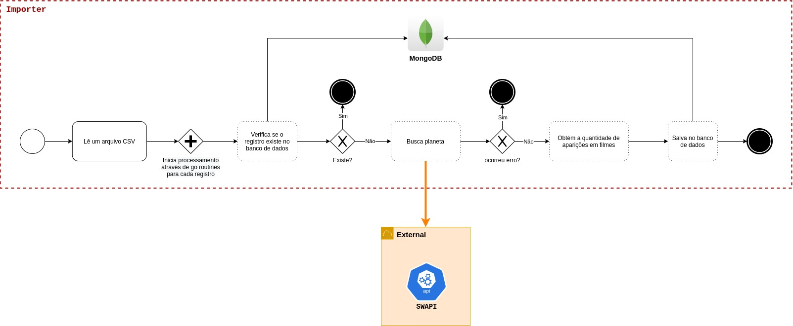
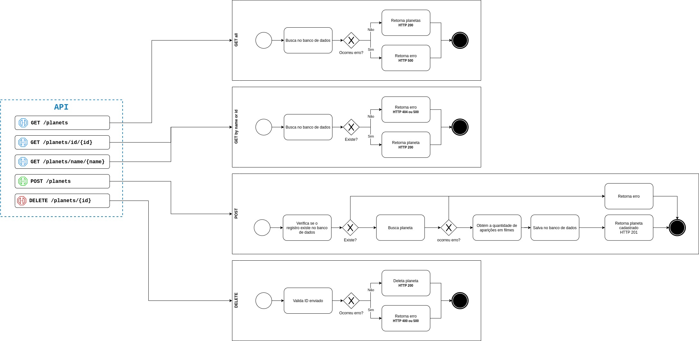

# Star Wars

#### Requisitos:

- Para cada planeta, os dados (`Nome, Clima, Terreno`) devem ser obtidos do banco de dados da aplicação, sendo inserido manualmente
- Para cada planeta também devemos ter a quantidade de aparições em filmes, que podem ser obtidas pela API pública do Star Wars: https://swapi.dev/about

#### Funcionalidades:

- Listar planetas
- Buscar por nome
- Buscar por ID
- Adicionar um planeta com nome, clima e terreno
- Remover planeta

# Projeto

## Importer

Responsável pelo cadastro de novos planetas, seu input é um arquivo CSV no formato `name;climate;terrain`  

path: `importer/cmd/main.go`  
csv: `importer/cmd/seed.csv`  

**Diagrama**  


### Como usar

Executar `docker-compose up importer`

---

## API

Ponto de entrada para integração externa

path: `api/cmd/main.go`  

**Diagrama**  
  

### Como usar  

Executar `docker-compose up api` ou pela open spec em `http://localhost:8080`  

---

### Data schema

```
Planet {
  id,         // d52ad233-02d2-4899-b014-d9c6dac62e5a
  name,       // Alderaan
  climate,    // temperate
  terrain,    // grasslands, mountains
  totalFilms  // 5
}
```

